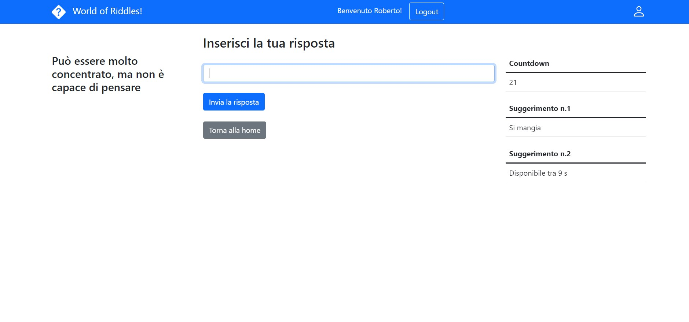

# Exam #2: "Indovinelli"
## Student: s303525 GELSI ALESSANDRO 

## React Client Application Routes

- Route `/`: Route radice che naviga a "/All" se lo stato loggedIn è true, a "/login" altrimenti
- Route `/login/`: Pagina che contiene il componente relativo alla gestione del login
- Route `/All/`: Pagina che contiene tutti gli indovinelli(divisi in stato aperto e chiuso) e l'attuale classifica. Risulta visibile solo agli utenti loggati
- Route `/MyRiddles/`: Pagina che contiene tutti gli indovinelli dell'utente loggato(divisi in base allo stato) e l'attuale classifica. Risulta visibile solo ad utenti loggati
- Route `/Anonimous/`: Pagina che contiene la lista di tutti gli indovinelli (testo, difficoltà, stato) e la classifica. Risulta visibile agli utenti che non si loggano ed accedono come anonimi
- Route `/Add/`: Pagina contenente il form per l'aggiunta di un nuovo indovinello
- Route `/DetailsOpen/:riddleId`: Pagina che permette di fornire una risposta ad un indovinello aperto. Il params "riddleId" è relativo all'id dell'indovinello di cui si vuole fornire risposta
- Route `/DetailsClosed/:riddleId`: Pagina che contiene le informazioni (risposte, risposta esatta, vincitore) relative ad un determinato indovinello. Il params "riddleId" è relativo all'id dell'indovinello di cui si richiedono informazioni
- Route `/userDetailsOpen/:riddleId`: Pagina che contiene le informazioni(risposte, countdown) relative ad un indovinello aperto, relativo all'utente che lo ha creato 


## API Server

-[GET] `/api/riddles`
  - Restituisce una lista di tutti gli indovinelli, senza risposta e suggerimenti. 
  - [`empty`]
  - [ `200 OK` ```  [{"id":2,"testo":"Viaggia in tutto il mondo stando in un angolo","durata":100,"stato":"chiuso","difficolta":"facile","user":1,"scadenza":"NULL"},{"id":3,"testo":"In che anno è nato il Polito?","durata":100,"stato":"chiuso","difficolta":"facile","user":1,"scadenza":"NULL"},...] ```]
  - [`500 Internal Server Error` (generic error).]


-[GET] `/api/riddles`
  - Restituisce una lista di tutti gli indovinelli(id,testo, difficoltà, stato) per la schermata anonima. 
  - [`empty`]
  - [ `200 OK` ``` [{"id":2,"testo":"Viaggia in tutto il mondo stando in un angolo","difficolta":"facile","stato":"chiuso"},{"id":3,"testo":"In che anno è nato il Polito?","difficolta":"facile","stato":"chiuso"},...] ```]
  - [`500 Internal Server Error` (generic error).]
  
-[GET] `/api/classification`
  - Restituisce la lista di utenti con i tre migliori punteggi.
  - [`empty`]
  - [ `200 OK` ```  [{"id":2,"name":"Marco","points":9},{"id":4,"name":"Mario","points":7},{"id":5,"name":"Michele","points":3}] ```]
  - [`500 Internal Server Error` (generic error).]

-[GET] `'/api/ClosedRiddle/:id'`
  - Restituisce le info da mostrare di un determinato indovinello chiuso.
  - [`empty`]
  - [ `200 OK` ```  {"id":9,"testo":"Sa scrivere, ma non può leggere","risposta":"Mano","vincitore":"Marco"} ```]
  - [`500 Internal Server Error` (generic error).]

-[GET] `'/api/responses/:id'`
  - Restituisce tutte le risposte date per un determinato indovinello.
  - [`empty`]
  - [ `200 OK` ``` [{"id":155,"risposta":"Cuore","indovinello":100,"userId":1},{"id":156,"risposta":"Uova","indovinello":100,"userId":2}...] ```]
  - [`500 Internal Server Error` (generic error).]

-[GET] `'/api/responses'`
  - Restituisce tutte le risposte date di tutti gli indovinelli.
  - [`empty`]
  - [ `200 OK` ```  [{"id":155,"risposta":"Cuore","indovinello":5,"userId":1},{"id":156,"risposta":"Uova","indovinello":7,"userId":1},{"id":157,"risposta":"Parola","indovinello":8,"userId":2},{"id":158,"risposta":"Mano","indovinello":9,"userId":2},{"id":159,"risposta":"Fiato","indovinello":13,"userId":3},{"id":160,"risposta":"Senso unico","indovinello":14,"userId":3},{"id":161,"risposta":"Montagna","indovinello":16,"userId":4},{"id":162,"risposta":"Coraggio","indovinello":17,"userId":4},{"id":163,"risposta":"Francobollo","indovinello":2,"userId":5},{"id":164,"risposta":"1859","indovinello":3,"userId":5},{"id":165,"risposta":"da","indovinello":31,"userId":2}] ```]
  - [`500 Internal Server Error` (generic error).]

-[GET] `'/api/riddles/:id'`
  - Restituisce tutte le info di  un determinato indovinello.
  - [`empty`]
  - [ `200 OK` ```  {"id":2,"testo":"Viaggia in tutto il mondo stando in un angolo","difficolta":"facile","stato":"chiuso"} ```]
  - [`500 Internal Server Error` (generic error).]

-[GET] `'/api/riddleText/:id'`
  - Restituisce il solo testo di un determinato indovinello.
  - [`empty`]
  - [ `200 OK` ```  {"id":6,"testo":"Io sono pur padre di dodici figli e tutti quanti sono mortali"} ```]
  - [`500 Internal Server Error` (generic error).]

-[GET] `'/api/riddleScadenza/:id'`
  - Restituisce la scadenza di un determinato indovinello.
  - [`empty`]
  - [ `200 OK` ```  {"id":6,"scadenza": 1685942} ```]
  - [`500 Internal Server Error` (generic error).]

-[GET] `'/api/riddleResponse/:id'`
  - Restituisce la risposta corretta di un determinato indovinello.
  - [`empty`]
  - [ `200 OK` ```  [{"id":163,"risposta":"Francobollo"}] ```]
  - [`500 Internal Server Error` (generic error).]

-[GET] `'/api/riddleSugg1/:id'`
  - Restituisce il  suggerimento 1 di un determinato indovinello.
  - [`empty`]
  - [ `200 OK` ```  {"id":6,"suggerimento1":"Si mangia"} ```]
  - [`500 Internal Server Error` (generic error).]

-[GET] `'/api/riddleSugg2/:id'`
  - Restituisce il  suggerimento 2 di un determinato indovinello.
  - [`empty`]
  - [ `200 OK` ```  {"id":6,"suggerimento2":"Si mangia"} ```]
  - [`500 Internal Server Error` (generic error).]

-[POST] `'/api/riddle'`
  - Crea un nuovo riddle
  - [ ```{
    "testo": "Si vedono in estate e lampeggiano nell'aria",
    "durata": 30,
    "risposta": "Lucciole",
    "suggerimento1": "si vedono di notte",
    "suggerimento2": "sono insetti",
    "stato": "aperto",
    "difficolta": "facile"
    }```]
  - [`201 Created`]
  - [`422 Unprocessable Entity` (validation of request body failed).`503 Service Unavailable` (generic error).]

-[POST] `'/api/response'`
  - Crea una nuova risposta
  - [ ```{
    "testo": "Natale",
    "indovinello": "6",
    "userId": 1
      }```]
  - [`201 Created`]
  - [`422 Unprocessable Entity` (validation of request body failed).`503 Service Unavailable` (generic error).]

-[PUT] `'/api/userPoints/:userId'`
  - Aggiorna il punteggio di un determinato utente
  - [ ```{
    "pointsToAdd": 3,
      }```]
  - [`200 OK`]
  - [`404 Not found` (Riddle not existing).`422 Unprocessable Entity` (validation of request body failed).`503 Service Unavailable` (generic error).]

-[PUT] `'/api/riddleState/:riddleId'`
  - Aggiorna lo stato di un determinato indovinello
  - [ ```{
    "stato": "chiuso",
      }```]
  - [`200 OK`]
  - [`404 Not found` (Riddle not existing).`422 Unprocessable Entity` (validation of request body failed).`503 Service Unavailable` (generic error).]

-[PUT] `' /api/riddleScadenza/:riddleId'`
  - Aggiorna la scadenza di un determinato indovinello
  - [ ```{
    "scadenza": 1658988744,
      }```]
  - [`200 OK`]
  - [`404 Not found` (Riddle not existing).`422 Unprocessable Entity` (validation of request body failed).`503 Service Unavailable` (generic error).]


-[PUT] `'/api/riddleVincitore/:riddleId'`
  - Aggiorna il vincitore di un determinato indovinello
  - [ ```{
    "vincitore": "Mario",
      }```]
  - [`200 OK`]
  - [`404 Not found` (Riddle not existing).`422 Unprocessable Entity` (validation of request body failed).`503 Service Unavailable` (generic error).]

-[POST] `'/api/sessions'`
  - Login session
  - [```{
    "username": "testuser@polito.it",
    "password": "password"
    }```]
  - [`200 OK` ```{"id":1,"username":"testuser@polito.it","name":"test"}```]
  - [`401 unauthorized` (Wrong username or password).]

-[POST] `'/api/sessions/current'`
  - Logout
  - [empty]
  - [`200 OK` (success).]
  - []

-[GET] `'/api/sessions/current'`
  - Check if the user is logged in or not
  - [empty]
  - [`200 OK` ```{"id":1,"username":"testuser@polito.it","name":"test"}```]
  - [`404 Not found` (Film not existing). `401 Unauthenticated user` (User not logged).]

## Database Tables

- Table `users` - contiene i campi: id, email, name, hash, salt, points
- Table `risposte` - contiene i campi: id, risposta, indovinello, userId
- Table `indovinelli` - contiene i campi: id, testo, durata, risposta, suggerimento1, suggerimento2, stato, difficolta, user, vincitore, scadenza

## Main React Components

- `AnonimousContent` (in `AnonimousContent.js`): Componente che contiene una Table per mostrare agli utenti anonimi la lista degli indovinelli con difficoltà e stato, insieme ad un componente "MyClassification" per la classifica generale.  
- `MyClassification` (in `MyClassification.js`): Componente che contiene una Table per mostrare utente e punteggio relativo ai migliori tre punteggi in classifica.
- `MySidebar` (in `MySidebar.js`): Sidebar che permette di navigare, una volta loggati, tra le lista di tutti gli indovinelli e quella relativa ai soli indovinelli dell'utente loggato.
- `RiddleClosedDetail` (in `RiddleClosedDetail.js`): Componente che contiene un insieme di Table per mostrare testo, risposta esatta, risposte date e vincitore di un indovinello in stato chiuso. Presenta un button per tornare alla lista contenente tutti gli indovinelli.
- `RiddleContent` (in `RiddleContent.js`): Componente che contiene una MySidebar, insieme alla lista di tutti gli indovinelli(testo e difficolta) all'interno di un component MyTable.  Presenta inoltre un componente MyAddButton per l'aggiunta di un nuovo indovinello.
- `MyTable` (in `MyTable.js`): Componente che contiene la lista degli indovinelli da mostrare in RiddleComponent. Ogni indovinello è associato ad un component RiddleData.
- `RiddleData` (in `MyTable.js`): Componente che contiene le informazioni relative al singolo indovinello, è utilizzato all'interno di MyTable. Presenta un button al cui click è associata la visualizzazione dei dettagli di un determinato indovinello.
- `RiddleForm` (in `RiddleForm.js`): Form che permette di inserire tutti i campi per la creazione di un nuovo indovinello. Presenta un button per sottoscrivere la creazione ed uno per annullarla.
- `RiddleOpenDetails` (in `RiddleOpenDetails.js`): Componente che permette ad un utente loggato di rispondere ad una domanda aperta appartenente ad un altro utente. Mostra il testo dell'indovinello, un form per rispondere e il relativo countdown. Presenta un button per tornare alla lista contenente tutti gli indovinelli.
- `UserRiddleOpenDetail` (in `UserRiddleOpenDetail.js`): Componente che contiene un insieme di Table per mostrare testo, risposte e countdown di un indovinello in stato aperto relativo all'utente loggato. Presenta un button per tornare alla lista contenente tutti gli indovinelli.
- `UserRiddleContent` (in `UserRiddleContent.js`): Componente che contiene una Table utilizzata per mostrare la lista dei soli indovinelli relativi all'utente loggato, insieme ad un component "MyClassification" per la classiffica.  Presenta un button per tornare alla lista contenente tutti gli indovinelli.


## Screenshot



## Users Credentials

| email | password | name |
|-------|----------|------|
| alessandro@polito.it| password | Alessandro |
| marco@polito.it| password | Marco |
| roberto@polito.it| password | Roberto |
| mario@polito.it| password | Mario |
| michele@polito.it| password | Michele |